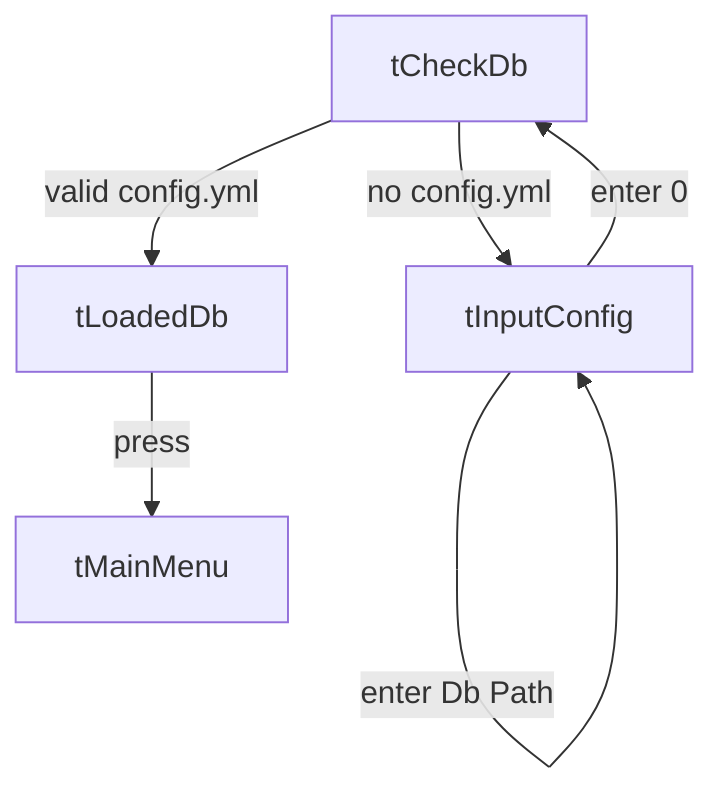

# Window nodes

## Terminal

```mermaid
flowchart TD
    0[tCheckDb] -- no config.yml --> 1[tInputConfig]
    1 -- enter Db Path --> 1
    1 -- enter 0 --> 0
    0 -- valid config.yml --> 2[tLoadedDb]
    2 -- press --> 3[tMainMenu]
```